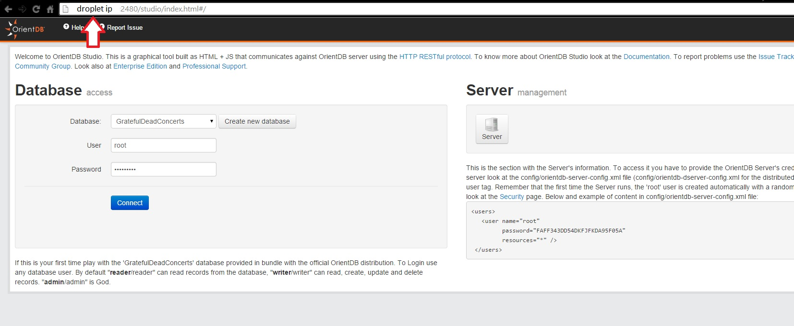
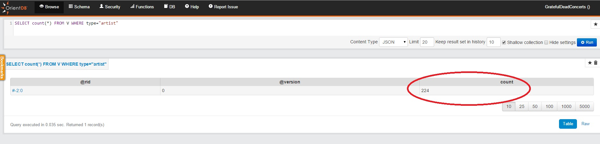

# How to start a graph database project with Flask and Orientdb

### Introduction

More and more people move away from using the relational databases as datastore. If you use relational database, SQLAlchemy is a great choice in Flask, if not, then OrientDB is a very good choice. 

Being OpenSource and having an SQL-like syntax are two very good reasons to choose it but if you'd like to learn more checkout http://www.orientechnologies.com/why-orientdb/ 

This tutorial is showing you how to install OrientDb and link it to simple Flask Application. 
For users that want more, there's a section how to implement redis on top of everything to speed things up.

The Protein interaction networks using Graph Databases
 

## Install OrientDB on your droplet

We need to install first java.

sudo apt-get update

Then, check if Java is not already installed:

java -version

if it's not installed then:

sudo apt-get install openjdk-7-jdk

download the "Linux and any other *NIX system" archive from  [orientdb download](http://www.orientechnologies.com/download/) and extract it into a directory. We'll use /home/orientdb_17
 
tar xvfz archivee.tar

## Configuring OrientDB

Setup a user and a password for the admin of OrientDB

sudo nano /home/orientdb_17/config/orientdb_config.txt

go to Users section, delete the previous entries, and write:

<user name="root" resources="*" password="your_password_here"/>

so it will look like this:

<users>
<user name="root" resources="*" password="your_password_here"/>
</users>

finally, start Orientdb by

sudo /home/orientdb_17/bin/server.sh &

Notice that in the /bin directory there's also a shutdown.sh script. You can use it to terminate the process when you want.

You can go now to http://your_droplet_ip:2480 and you should see this screen

 

Login and select the GreatfulDeadConcerts database.

## Install and configure Flask 

sudo apt-get install python-pip python-dev build-essential
sudo pip install Flask

and for the connection to OrientDB we'll use pyorinet [PyOrient Github](https://github.com/mogui/pyorient)

pip install pyorient

Working with pyorinent is easy, you can read more about it here [PyOrient Github](https://github.com/mogui/pyorient)

Create a new directory in /home/

sudo mkdir /home/my_flask_project

and inside create a new file application.py

from flask import Flask
app = Flask(__name__)

@app.route('/')
def index():
    return 'Hello World From Flask'

if __name__ == '__main__':
    app.run()

## Flask and OrientDb Interaction

### Simple queries

Getting the count of the artists in the sample database.
The first tab "BROWSE" it's where you type the queries

SELECT count(*) FROM V WHERE type="artist"

 

TODO: link them in flask
 
### more complex queries

- find who wrote the songs that artist "Garcia" sung

TODO: continue

### Troubleshooting 

TODO

## Where to go from here

TODO